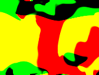
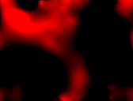

# Little Earth Sandbox

An Earth atmosphere simulator for toy ML experiments. Forked from the WebGL-based fluid dynamics simulator by [paveldogreat](https://paveldogreat.github.io/WebGL-Fluid-Simulation/). This simulation uses appropriate boundary conditions to map to a sphere, rather than a closed box.

To run, make sure you have a local Apache server turned on, and open the index in a web browser. On Mac OS this will run automatically in Chrome unless you have turned off the native Apache server.

## Automation

This simulator has a basic functionality to generate lots of random fluid data, and output screenshots of the density, velocity, pressure, curl, and divergence fields.

To avoid being prompted each time you'd like to save a file, you can do so in Chrome by going into Settings > Advanced > Downloads. Then, disable "Ask where to save each file before downloading." Captures will be saved to your Downloads folder.

## License

The code is available under the [MIT license](LICENSE).
